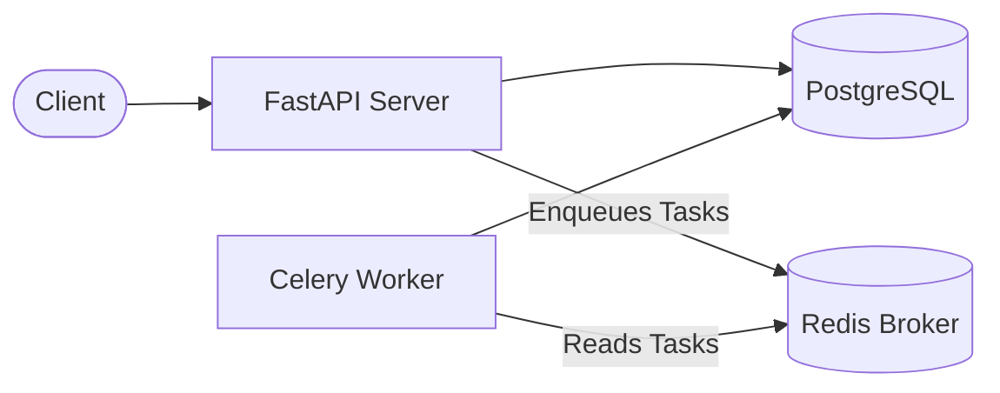

# FastAPI Microservice DevSecOps Pipeline

[](https://github.com/M-Fahim-Feroz/fastapi-devsecops-pipeline/actions/workflows/ci-cd.yml)
[](LICENSE)


## 1. Project Overview
This repository serves as a showcase of modern DevOps, DevSecOps, and CI/CD practices applied to a Python-based FastAPI microservice. It is designed to be a complete, production-style foundation demonstrating how to securely build, test, and containerize a multi-tier backend application.

## 2. What This Project Demonstrates
For hiring managers and technical interviewers, this project proves my ability to:
- Write robust, multi-stage, secure **Dockerfiles** following best practices (non-root users, minimal image footprints).
- Orchestrate multi-container applications (API, workers, databases, message brokers) using **Docker Compose** with proper health checks and dependencies.
- Build fully automated **CI/CD pipelines** using **GitHub Actions**.
- Integrate **DevSecOps** principles by embedding code linting (Flake8), static application security testing (Bandit), and container vulnerability scanning (Trivy) directly into the pipeline.
- Implement reliable local development environments that mirror production constructs.

## Project Highlights

- **Full DevSecOps pipeline** — lint (Flake8), SAST (Bandit), container scan (Trivy), and unit tests all run in CI before any image is pushed to Docker Hub
- **Multi-service local stack** — Docker Compose orchestrates FastAPI, PostgreSQL, Redis, and Celery worker with health checks and proper dependency ordering
- **Secure Docker image** — multi-stage build with non-root user, minimal base image, and vulnerability scanning on every commit
- **Fork-safe CI** — Docker image is built locally with a SHA tag for scanning on PRs; push to Docker Hub only happens on `main` branch merges
- **Async background tasks** — Celery + Redis worker processes jobs asynchronously, demonstrating production-grade task queue architecture
- **Automated test coverage** — Pytest integration tests run against a live PostgreSQL and Redis service container in GitHub Actions

## 3. Architecture
The application is a REST API that handles asynchronous workloads.

> See the [full architecture diagram](docs/architecture.md) with Mermaid flowcharts.



- **API Layer**: FastAPI for handling HTTP requests.
- **Background Tasks**: Celery for asynchronous processing of long-running jobs.
- **Database**: PostgreSQL for persistent relational data storage (users and weather).
- **Cache / Message Broker**: Redis for queuing Celery tasks and caching.
- **Containerization**: Docker engines hosting isolated network bridges for the services.

## 4. Tech Stack
- **Backend**: Python 3.10, FastAPI, Celery
- **Data**: PostgreSQL, Redis, SQLModel
- **DevOps**: Docker, Docker Compose
- **CI/CD**: GitHub Actions, Docker Hub
- **Security & Quality**: Trivy (Container Scanning), Bandit (SAST), Flake8 (Linting), Pytest (Testing)

## 5. Current Status
- [x] Local Docker Compose environment with proper health checks configured.
- [x] Multi-stage, secure Dockerfile implemented.
- [x] Automated testing and linting running on GitHub Actions.
- [x] Trivy container vulnerability scanning integrated into the CI/CD pipeline.
- [x] Automated image publishing to Docker Hub upon successful CI runs.

## 6. Local Setup
1. **Clone the repository:**
    ```bash
    git clone https://github.com/M-Fahim-Feroz/fastapi-devsecops-pipeline.git
    cd fastapi-devsecops-pipeline
    ```
2. **Configure environment variables:**
    ```bash
    cp .env.example .env
    # Edit .env with your specific secrets if necessary
    ```
3. **Start the environment:**
    ```bash
    docker compose up --build -d
    ```
4. **Access the application:**
    - Swagger UI Documentation: `http://localhost:81/docs`

## 7. CI/CD Pipeline
The GitHub Actions workflow (`.github/workflows/ci-cd.yml`) triggers on pushes and pull requests to the `main` and `dev` branches.
- **Build**: Installs Python dependencies.
- **Security & Lint**: Executes `flake8` for code style and `bandit` for SAST.
- **Test**: Spins up ephemeral Postgres and Redis service containers to run `pytest` integration tests.
- **Docker**: Builds the image and runs **Trivy** to scan for vulnerabilities.
- **Publish**: If the scan passes and the branch is `main`, securely publishes the tagged image to Docker Hub.

## 8. Security Scanning
Security is shifted left into the CI/CD pipeline:
- **Trivy**: Scans the built Docker image for `HIGH` and `CRITICAL` OS/library vulnerabilities before pushing. The build will fail if any are detected. *(Note: Initial Trivy findings for Python packages like `wheel` and `jaraco.context` were successfully remediated via dependency updates, and the pipeline now cleanly passes).*
- **Bandit**: Analyzes the Python AST to find common security issues in the codebase (e.g., hardcoded passwords, dangerous shell executions).

## 9. Repository Structure
```text
├── .github/workflows/   # GitHub Actions CI/CD pipelines
├── api/                 # FastAPI application source code
│   ├── tests/           # Pytest integration tests
│   ├── main.py          # API entrypoint
│   └── tasks.py         # Celery background workers
├── .dockerignore        # Optimized Docker build context exclusions
├── .env.example         # Template for local environment variables
├── docker-compose.yml   # Multi-container local orchestration
├── Dockerfile           # Multi-stage, secure container definition
└── requirements.txt     # Pinned Python dependencies
```

## 10. Screenshots / Proof of Work
- **CI/CD Pipeline Success:**
  
- **Trivy Vulnerability Scan Pass:**
  
- **Local Swagger UI Running:**
  
- **Docker Containers Running:**
  

## 11. Release & Changelog
### Suggested First Release
- **v1.0.0**: Initial portfolio-ready release.
  - Includes full CI/CD pipeline, security cleanup, and structured deployment documentation.
- See `CHANGELOG.md` for a complete history of updates.
- It is highly recommended to leverage [GitHub Releases](https://docs.github.com/en/repositories/releasing-projects-on-github/about-releases) to bundle version tags cleanly.

## 12. Portfolio Scope / Related Projects
**Important Note:** This specific repository focuses strictly on CI/CD, Docker, local orchestration, and DevSecOps. 
To keep the portfolio modular and focused:
- **AWS Deployment & Infrastructure as Code (Terraform)** are intentionally handled in a **separate portfolio project**.
- **Kubernetes (EKS) Orchestration** is implemented in a **separate portfolio project**.

I do not claim AWS, Terraform, or Kubernetes implementation within this specific repository.

## 12. CV Bullets
*(If you are reading this from my resume, here is what this repository correlates to)*
- Engineered a robust CI/CD pipeline using GitHub Actions to automate linting, testing, and Docker image publishing.
- Integrated DevSecOps practices by implementing Trivy and Bandit to enforce container and code-level security scanning, failing builds on critical vulnerabilities.
- Containerized a multi-tier Python architecture (FastAPI, Celery, PostgreSQL, Redis) using multi-stage Docker builds and minimal non-root base images.
- Designed a reproducible local development environment using Docker Compose with automated service health checks.
