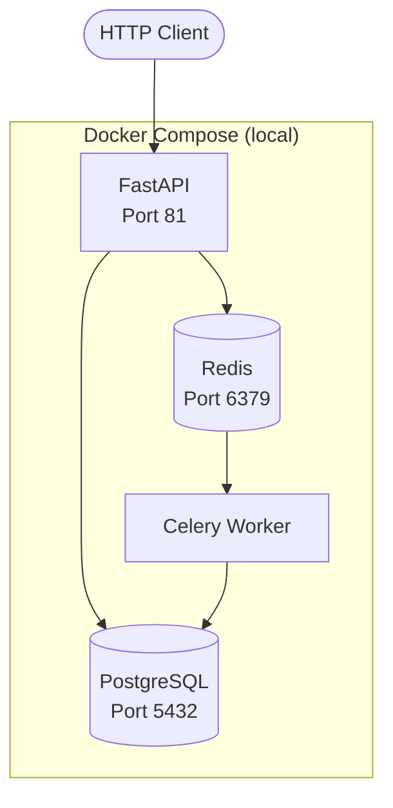
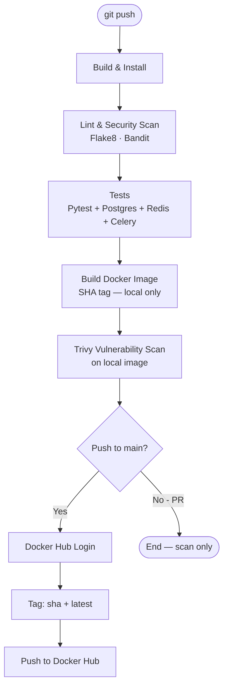
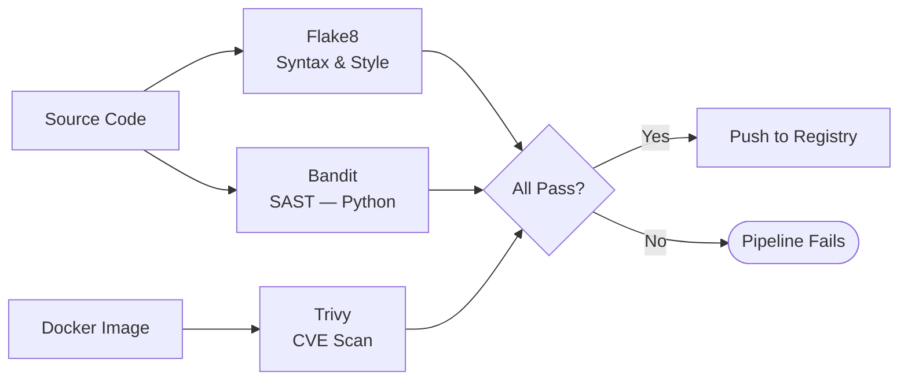

# Architecture — FastAPI DevSecOps Pipeline

## Application Stack

```mermaid
flowchart TD
    Client([HTTP Client]) --> API[FastAPI\nPort 81]
    API --> DB[(PostgreSQL\nPort 5432)]
    API --> Redis[(Redis\nPort 6379)]
    Redis --> Worker[Celery Worker]
    Worker --> DB
    subgraph compose["Docker Compose (local)"]
        API
        DB
        Redis
        Worker
    end
```

## CI/CD Pipeline

```mermaid
flowchart TD
    Push([git push]) --> Build[Build & Install]
    Build --> Lint[Lint & Security Scan\nFlake8 · Bandit]
    Lint --> Test[Tests\nPytest + Postgres + Redis + Celery]
    Test --> Docker[Build Docker Image\nSHA tag — local only]
    Docker --> Trivy[Trivy Vulnerability Scan\non local image]
    Trivy --> Gate{Push to main?}
    Gate -->|Yes| Login[Docker Hub Login]
    Gate -->|No - PR| Skip([End — scan only])
    Login --> Tag[Tag: sha + latest]
    Tag --> Push2[Push to Docker Hub]
```

## Security Controls

```mermaid
flowchart LR
    Code[Source Code] --> Flake8[Flake8\nSyntax & Style]
    Code --> Bandit[Bandit\nSAST — Python]
    Image[Docker Image] --> Trivy[Trivy\nCVE Scan]
    Flake8 --> Gate{All Pass?}
    Bandit --> Gate
    Trivy --> Gate
    Gate -->|Yes| Deploy[Push to Registry]
    Gate -->|No| Fail([Pipeline Fails])
```

[← README](../README.md)
